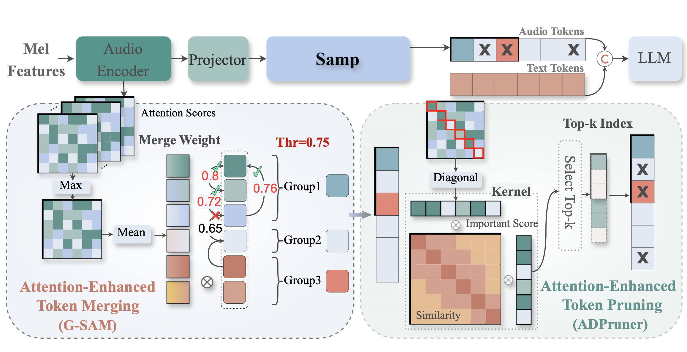

#  Samp: Similarity-Attention Boosted Merging-and-Pruning Token Compression for Efficient Speech LLMs

This repository contains the code for the paper [Samp: Similarity-Attention Boosted Merging-and-Pruning Token Compression for Efficient Speech LLMs](xxx)

## Overview
**Samp** is a plug-and-play compression framework for **S**imilarity-**A**ttention driven joint token **M**erging and **P**runing that exploits the inherent temporal dependencies of speech. **Samp** consistently establishes new state-of-the-art (SOTA) benchmarks, outperforming established baselines. 

|  |
| :--------------------------------------: |
| *Overview of the proposed <b>Samp</b>* |


## ✨ Introduction

- We introduce an adaptive, hardware-friendly, plug-andplay framework driven by the synergy of similarity and attention for joint token Merging and Pruning.
- Similarity and Attention are synergistically integrated, merging employs intra-group global similarity with attention-guided weighted aggregation; pruning uses a similarity-attention integrated kernel for diversity driven pruning.
- Extensive validation on multiple public speech datasets and mainstream Speech LLMs confirms the method’s effectiveness and generalization across ASR and audio understanding tasks.

## 🚀 Supported Models
- [Qwen2-Audio](https://huggingface.co/Qwen/Qwen2-Audio-7B)
- [Kimi-Audio](https://huggingface.co/moonshotai/Kimi-Audio-7B-Instruct)
- [GLM-ASR](https://huggingface.co/zai-org/GLM-ASR-Nano-2512)

## 🛠️ Installation

```bash
# Clone the repository
git clone https://github.com/Tencent/AngelSlim.git
cd AngelSlim
git checkout samp
git submodule update --init --recursive

# create envs
conda create -n samp python=3.10
conda activate samp

# Install dependencies
pip install -r requirements.txt

# Note
# run GLM-ASR using transformers==4.51.3
```

## 💻 Quick Start

run_audio.sh is the entry point for evaluation. You can get help using `--help`

For example, to evaluate models on all datasets:
```bash
cd Samp
bash run_eval.sh
```
By default, inference results, evaluation results, and metric reports will be generated in the eval_results directory under the current directory. You can change this behavior by passing --work-dir.

Using --skip-eval allows the model to only perform inference without evaluation, which helps keep your GPU running efficiently.

After inference is complete, you can run the command again to start evaluation. You can add the --reeval parameter to force re-evaluation of the dataset, which won't trigger re-inference but will regenerate the metric report.

> Unlike the toolbox, we do not employ GPT-4o-mini as the judge model for the sparsity task. Instead, we use a string matching approach to ensure a fair comparison.

## 📚 Datasets
Downloading datasets can see [here](https://github.com/MoonshotAI/Kimi-Audio-Evalkit/blob/master/data/download_benchmark.py).

| Dataset Category | Datasets |
|-----------------|----------|
| ASR | LibriSpeech, Fleurs-zh, Fleurs-en, AISHELL-1, AISHELL-2, WenetSpeech |
| MQA | mmau-test-mini, MELD, Nonspeech7k, TUT2017, VocalSound |


## 📊 Performance
**Table 1. Performance comparison of different pruning methods on ASR dense tasks (Qwen2-audio / Kimi-Audio / GLM-ASR)**
| Method | LibriSpeech dev_clean | LibriSpeech dev_other | LibriSpeech test_clean | LibriSpeech test_other | Fleurs zh | Fleurs en | AISHELL-1 | AISHELL-2 | WenetSpeech test-meeting | WenetSpeech test-net | Average |
| ------ | --------------------- | --------------------- | ---------------------- | ---------------------- | --------- | --------- | --------- | --------- | ------------------------ | --------------------- | ------- |
| **Qwen2-Audio** | 1.67 | 3.65 | 1.74 | 4.03 | 3.63 | 5.20 | 1.52 | 3.08 | 8.40 | 7.64 | 4.06 |
| <tr><td colspan="12" align="center"><strong>Retain 60% Tokens(40% Compression Ratio)</strong></td></tr> |
| VisionZip | 7.31 | 10.35 | 7.08 | 10.10 | 8.02 | 6.85 | 6.99 | 13.85 | 17.88 | 23.75 | 11.22 |
| VisPruner | 7.42 | 9.74 | 7.20 | 9.69 | 7.00 | 8.39 | 6.91 | 9.67 | 13.37 | 14.07 | 9.35 |
| CDPruner | 4.22 | 6.05 | 4.18 | 6.53 | 4.88 | 7.17 | 2.70 | 4.62 | 12.29 | 10.90 | 6.35 |
| A-ToMe | 4.12 | 6.81 | 4.20 | 6.98 | 8.00 | 8.13 | 4.18 | 5.66 | 14.05 | 14.15 | 7.62 |
| FastAdaSP | 4.91 | 7.26 | 4.95 | 7.51 | 5.47 | 7.31 | 3.28 | 4.69 | 11.51 | 12.30 | 6.92 |
| **Samp** | **2.59** | **5.00** | **2.72** | **5.02** | **4.37** | **5.94** | **2.69** | **4.42** | **11.05** | **10.11** | **5.39** |
| <tr><td colspan="12"></td></tr> |
| **Kimi-Audio** | 1.23 | 2.39 | 1.38 | 2.45 | 2.87 | 4.92 | 0.61 | 2.57 | 6.33 | 5.39 | 3.01 |
| <tr><td colspan="12" align="center"><strong>Retain 60% Tokens(40% Compression Ratio)</strong></td></tr> |
| VisionZip | 6.35 | 7.94 | 5.93 | 7.71 | 7.63 | 8.91 | 6.84 | 10.01 | 14.65 | 19.51 | 9.55 |
| VisPruner | 5.36 | 6.90 | 5.07 | 6.75 | 5.73 | 7.82 | 4.36 | 7.65 | 13.70 | 18.56 | 8.19 |
| CDPruner | 5.70 | 6.96 | 5.44 | 6.78 | 6.73 | 8.66 | 5.07 | 9.21 | 14.95 | 18.41 | 8.79 |
| A-ToMe | 4.13 | 6.04 | 3.92 | 5.87 | 6.26 | 7.57 | 3.58 | 6.88 | 12.97 | 14.99 | 7.22 |
| FastAdaSP | 4.49 | 6.15 | 4.28 | 6.02 | 4.27 | 7.64 | 2.22 | 5.67 | 12.62 | 14.75 | 6.81 |
| **Samp** | **2.32** | **3.67** | **2.49** | **3.75** | **4.37** | **6.26** | **2.05** | **3.99** | **11.47** | **12.35** | **5.27** |
| <tr><td colspan="12"></td></tr> |
| **GLM-ASR-Nano** | 2.14 | 4.05 | 2.18 | 4.53 | 3.44 | 4.11 | 2.47 | 3.48 | 8.43 | 6.65 | 4.15 |
| <tr><td colspan="12" align="center"><strong>Retain 70% Tokens(30% Compression Ratio)</strong></td></tr> |
| VisionZip | 9.18 | 12.75 | 8.27 | 13.27 | 8.17 | 8.08 | 13.9 | 20.55 | 19.36 | 20.45 | 13.40 |
| VisPruner | 9.22 | 12.33 | 8.34 | 12.13 | 6.95 | 8.33 | 11.68 | 14.57 | 18.11 | 16.56 | 11.82 |
| CDPruner | 5.38 | 7.75 | 5.28 | 7.76 | 4.99 | 5.93 | 4.88 | 5.94 | 14.21 | 11.70 | 7.38 |
| A-ToMe | 4.55 | 8.04 | 4.66 | 7.83 | 5.08 | 5.77 | 5.40 | 5.95 | 13.16 | 12.08 | 7.25 |
| FastAdaSP | 6.45 | 10.34 | 6.50 | 10.41 | 4.34 | 6.70 | 6.42 | 7.02 | 16.10 | 14.10 | 8.84 |
| Samp | **3.41** | **5.53** | **3.43** | **5.55** | **3.76** | **4.83** | **3.53** | **4.52** | **12.07** | **9.60** | **5.62** |


**Table 2. Performance comparison of different pruning methods on Audio Understanding tasks (Qwen2-Audio / Kimi-Audio)**
| Method | MELD | mmau-test-mini music | mmau-test-mini sound | mmau-test-mini speech | Nonspeech7k | TUT2017 | VocalSound | Average |
| ------ | ---- | -------------------- | -------------------- | --------------------- | ----------- | ------- | ---------- | ------- |
| **Qwen2-Audio** | 51.19 | 60.48 | 72.07 | 60.36 | 86.48 | 32.35 | 88.00 | 64.42 |
| <tr><td colspan="9" align="center"><strong>Retain 50% Tokens(50% Compression Ratio)</strong></td></tr>|
| VisionZip | 51.73 | 60.48 | 72.07 | 61.56 | 85.38 | 31.73 | 86.33 | 64.18 |
| VisPruner | 50.88 | 61.68 | 73.87 | 62.16 | 84.69 | 30.74 | 86.22 | 64.32 |
| CDPruner | 51.61 | 61.38 | 71.77 | 61.26 | 86.62 | 31.73 | 87.50 | 64.55 |
| A-ToMe | 50.15 | 61.38 | 71.17 | 56.46 | 83.45 | 29.20 | 84.32 | 62.30 |
| FastAdaSP | 50.81 | 59.88 | 72.07 | 59.46 | 83.86 | 31.23 | 85.96 | 63.32 |
| **Samp** | **51.96** | **61.38** | 72.07 | **63.06** | 85.10 | **32.53** | **87.64** | **64.82** |
| <tr><td colspan="9"></td></tr> |
| **Kimi-Audio** | 57.48 | 63.77 | 79.28 | 65.77 | 93.10 | 61.11 | 94.24 | 73.54 |
| <tr><td colspan="9" align="center"><strong>Retain 50% Tokens(50% Compression Ratio)</strong></td></tr>|
| VisionZip | 57.78 | 63.47 | 79.88 | 61.86 | 90.21 | 60.56 | 93.23 | 72.43 |
| VisPruner | 56.67 | 65.57 | 79.88 | 63.66 | 90.21 | 60.25 | 93.21 | 72.78 |
| CDPruner | 57.40 | 63.17 | 79.58 | 65.17 | 89.52 | 60.31 | 93.15 | 72.61 |
| A-ToMe | 57.25 | 64.67 | 79.28 | 63.66 | 92.14 | 60.68 | 93.40 | 73.01 |
| FastAdaSP | 56.79 | 63.47 | 79.88 | 66.37 | 90.48 | 60.37 | 93.34 | 72.96 |
| **Samp** | 56.40 | **65.57** | **79.88** | **66.37** | 90.76 | 60.19 | **93.43** | **73.23** |


>- We migrate the vision domain pruning methods, such as [VisionZip](https://github.com/JIA-Lab-research/VisionZip), [VisPruner](https://github.com/Theia-4869/VisPruner), and [CDPruner](https://github.com/Theia-4869/CDPruner), to speech models.
>- For a fair comparison, we modify the two methods, [A-ToMe](https://www.isca-archive.org/interspeech_2023/li23i_interspeech.pdf) and [FastAdasp](https://github.com/yichen14/FastAdaSP), which perform merging within the LLM block, to merge after the projector instead. 


## Acknowledgements
This repository is built based on [Kimi-Audio-Evalkit](https://github.com/MoonshotAI/Kimi-Audio-Evalkit/tree/master), [Qwen2-Audio](https://huggingface.co/Qwen/Qwen2-Audio-7B), [GLM-ASR](https://huggingface.co/zai-org/GLM-ASR-Nano-2512), [VisionZip](https://github.com/JIA-Lab-research/VisionZip), [VisPruner](https://github.com/Theia-4869/VisPruner), [CDPruner](https://github.com/Theia-4869/CDPruner), [A-ToMe](https://www.isca-archive.org/interspeech_2023/li23i_interspeech.pdf) and [FastAdasp](https://github.com/yichen14/FastAdaSP). Thanks for their contributions!

## 🔒 License
- The majority of this project is released under the Apache 2.0 license as found in the [LICENSE](../LICENSE) file.
- For [Kimi-Audio-Evalkit](https://github.com/MoonshotAI/Kimi-Audio-Evalkit/tree/master), [Qwen2-Audio](https://huggingface.co/Qwen/Qwen2-Audio-7B), [GLM-ASR](https://huggingface.co/zai-org/GLM-ASR-Nano-2512), [VisionZip](https://github.com/JIA-Lab-research/VisionZip), [VisPruner](https://github.com/Theia-4869/VisPruner), [CDPruner](https://github.com/Theia-4869/CDPruner), [A-ToMe](https://www.isca-archive.org/interspeech_2023/li23i_interspeech.pdf) and [FastAdasp](https://github.com/yichen14/FastAdaSP), please follow their LICENSE.

## Citation

```

```