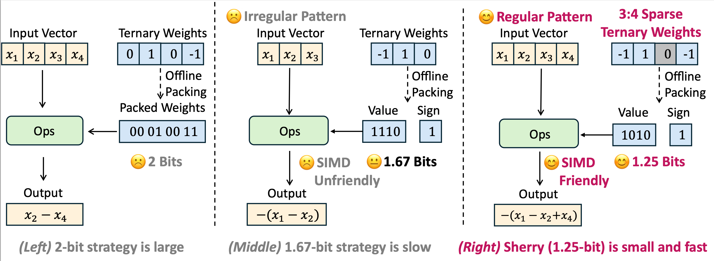

#  Sherry: Hardware-Efficient 1.25-Bit Ternary Quantization via Fine-grained Sparsification

This repository contains the code for the paper [Sherry: Hardware-Efficient 1.25-Bit Ternary Quantization via Fine-grained Sparsification](https://arxiv.org/abs/2601.07892)

## Overview
Sherry is a hardware-efficient 1.25bit ternary quantization framework that resolves the fundamental tension between bit efficiency and hardware alignment for deploying Large Language Models (LLMs) on resource-constrained edge devices.

|  |
| :--------------------------------------: |
| *Overview of the proposed <b>Sherry</b>* |


## 🚀 Key Features
- **3:4 Fine-Grained Sparsity:** Achieves a regularized 1.25-bit width by packing blocks of four weights into five bits, restoring power-of-two alignment
- **Arenas Mechanism:** Novel annealing residual synapse mechanism that prevents weight trapping and representational collapse during sparse ternary training
- **Hardware-Optimized:** Designed for commodity hardware with 25% bit savings and 10% inference speedup compared to existing ternary methods

## 🛠️ Installation

```bash
# Clone the repository
git clone https://github.com/yourusername/sherry.git

## create envs
conda create -n sherry python=3.10
conda activate sherry

# Install dependencies
pip install -r requirements.txt
```

## 📚 Dataset
Sherry supports ```HuggingFace``` and provides tools for seamless integration. All datasets are available on HuggingFace and will be automatically downloaded if the ```transformers``` package is properly installed. Just use ```make_data_module``` function in ```utils/datautils_e2e.py``` to config your datasest.

## 💻 Quick Start
If you want to simply use our supported models and datasets, you can run the experiments using the bash files. 

take dataset ```ultrafineweb``` (10B) for example, edit the ```script/train_llama_1b.sh```
```bash
torchrun --nnodes=1 --nproc_per_node=8 train_llama.py \
--dataset_root "/path/to/dataset" \  #the root path to load the dataset or cache
--local_dir "./output/Llama-3.2-1B" \ # the root path to save the model 
--model_path "../../model_zoo/Llama-3.2-1B/" \ # the model path
--model_family "llama-3.2-1B" \ # the model name (only affect the log)
--output_model_filename "1B-1epoch" \ # the name of saving path
--quant_method "sherry" \ # the quantization method, options:[absmean, twn, ggd, lsq, quaternary_static]
--granularity "per_group" \ # the quantization granularity, including per_tensor, per_channel, per_group
--group_size 32 \ # if per_group, the group size. 
--w_bits 0 \ # weight bit-width, 0 indicate the 1.58 bit
--num_train_epochs 1 \ # number of training epoch
--model_max_length 1024 \ 
--pt_context_len 1024 \
--source_max_len 1024 \
--target_max_len 1024 \
--dataset "ultrafineweb-10b" \
--dataset_format "pt" \
--do_train True \
--do_eval False \
--fp16 False \
--bf16 True \
--log_on_each_node False \
--logging_dir "./output/Llama-3.2-1B" \
--per_device_train_batch_size 8 \
--per_device_eval_batch_size 8 \
--gradient_accumulation_steps 16 \
--save_strategy "steps" \
--save_steps 250 \ # saving checkpoint per x steps
--report_to "none" \
--save_total_limit 3 \
--learning_rate 2e-5 \
--weight_decay 0. \
--warmup_ratio 0. \
--lr_scheduler_type "cosine" \
--logging_steps 1 \
--tf32 False \
--gradient_checkpointing False \
--qat True 
```
Then, run the ```script/run_llama_1b.sh```

The output model and checkpoints will be saved in ```{local_dir}/{datasets}/{output_model_filename}-{w_bits}b_{quant_method}_{granularity}_{group_size}g_{enable_zero_point}(zero)```

## Evaluate
put the correct model_path and quantization information into ```script/test_llama_1b.sh```

```bash
mdp=/path/to/trained_model/ 

python3 test_llama.py \
--model_path $mdp \
--w_bits 0 \
--eps 1e-3 \
--quant_method "sherry" \
--granularity "per_group" \
--model_family "llama" \
--group_size 128 \
--do_train False \
--do_eval True \
--N 3 \
--M 4 \
--model_max_length 1024 \
--pt_context_len 1024 \
--source_max_len 1024 \
--target_max_len 1024 \
--fp16 False \
--bf16 True \
--per_device_train_batch_size 16 \
--per_device_eval_batch_size 16 \
--report_to "none" \
--contain_weight_clip_val False \
--do_mmlu_eval False \
--eval_tasks piqa,arc_easy,arc_challenge,hellaswag,winogrande \
```

## Citation

```
@misc{huang2026sherryhardwareefficient125bitternary,
      title={Sherry: Hardware-Efficient 1.25-Bit Ternary Quantization via Fine-grained Sparsification}, 
      author={Hong Huang and Decheng Wu and Qiangqiang Hu and Guanghua Yu and Jinhai Yang and Jianchen Zhu and Xue Liu and Dapeng Wu},
      year={2026},
      eprint={2601.07892},
      archivePrefix={arXiv},
      primaryClass={cs.LG},
      url={https://arxiv.org/abs/2601.07892}, 
}
```

## Acknowledgements

Our code is modified from [ParetoQ](https://arxiv.org/abs/2502.02631).
